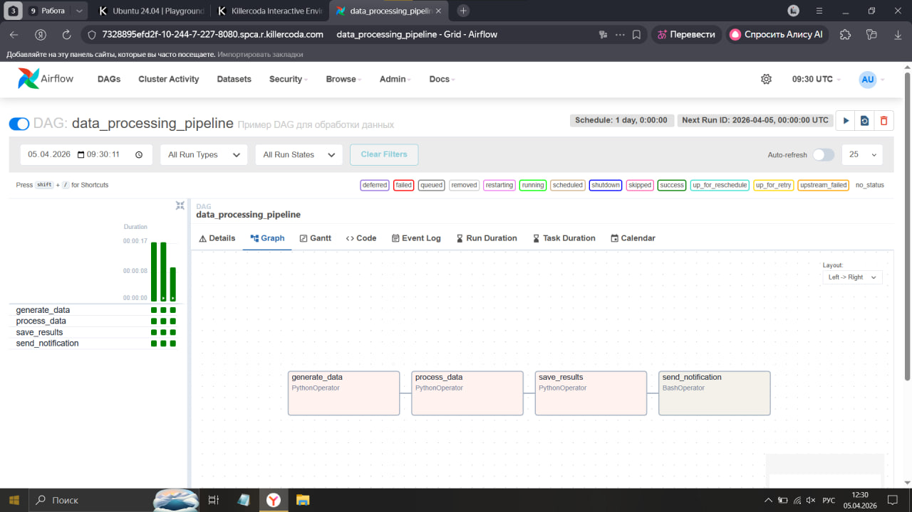
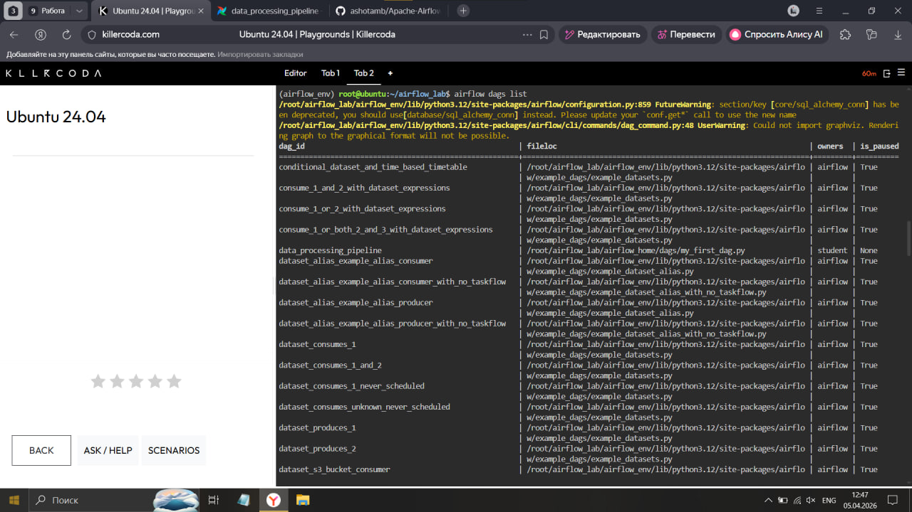
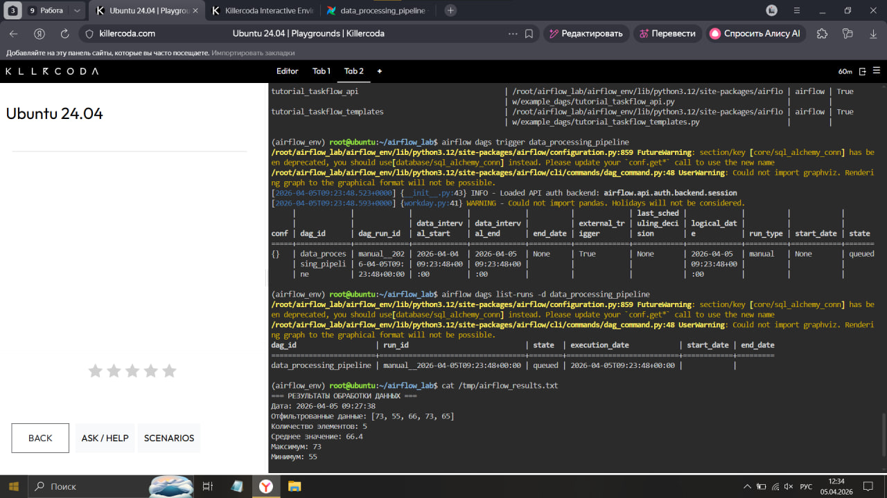
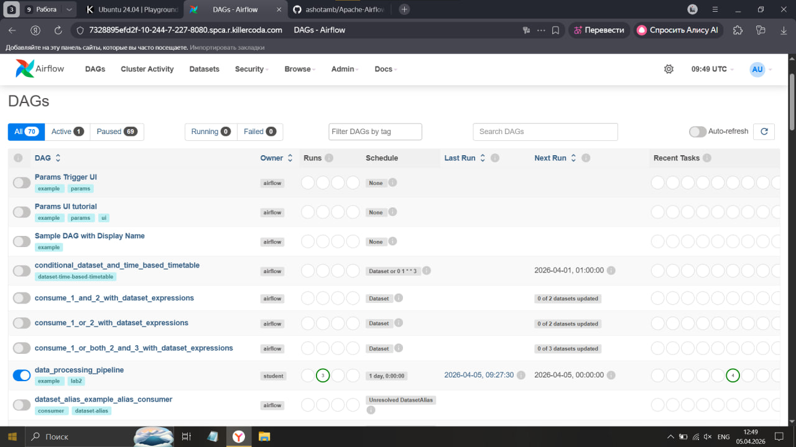

# Лабораторная работа №2
## «Оркестрирование выполнения задач обработки данных с использованием Apache Airflow»

**Цель:** научиться создавать системы работы с потоками данных с использованием Apache Airflow.

---

## Задачи
- Развернуть приложение Apache Airflow
- Разработать DAG
- Поставить DAG на выполнение в Apache Airflow

---

## Среда выполнения
- **ОС:** Ubuntu 24.04 (онлайн через KillerCoda)
- **Python:** 3.12.3
- **Apache Airflow:** 2.10.3

---

## Шаг 1: Установка Python
```bash
sudo apt-get update -y
sudo apt-get install -y python3 python3-pip python3-venv
python3 --version
```

---

## Шаг 2: Установка Apache Airflow
```bash
mkdir ~/airflow_lab && cd ~/airflow_lab
python3 -m venv airflow_env
source airflow_env/bin/activate
pip install --upgrade pip

AIRFLOW_VERSION=2.10.3
PYTHON_VERSION="$(python3 --version | cut -d " " -f 2 | cut -d "." -f 1-2)"
CONSTRAINT_URL="https://raw.githubusercontent.com/apache/airflow/constraints-${AIRFLOW_VERSION}/constraints-${PYTHON_VERSION}.txt"
pip install "apache-airflow==${AIRFLOW_VERSION}" --constraint "${CONSTRAINT_URL}"
```

---

## Шаг 3: Запуск Apache Airflow
```bash
export AIRFLOW_HOME=~/airflow_lab/airflow_home
airflow db init
airflow users create --username admin --firstname Admin --lastname User --role Admin --email admin@example.com --password admin123
airflow standalone
```

---

## Шаг 4: DAG — описание

DAG `data_processing_pipeline` состоит из 4 задач:

| Задача | Тип | Описание |
|--------|-----|----------|
| `generate_data` | PythonOperator | Генерирует список из 10 случайных чисел (1–100) |
| `process_data` | PythonOperator | Фильтрует числа > 50, считает статистику |
| `save_results` | PythonOperator | Сохраняет результаты в файл `/tmp/airflow_results.txt` |
| `send_notification` | BashOperator | Выводит содержимое файла результатов |

### Граф выполнения



---

## Шаг 5: Загрузка и запуск DAG
```bash
# DAG автоматически подхватывается из папки dags/
airflow dags list
airflow dags trigger data_processing_pipeline
airflow dags list-runs -d data_processing_pipeline
```



---

## Результаты выполнения




---

## Структура репозитория
```
airflow-lab2/
├── README.md
├── dags/
│   └── my_first_dag.py
└── screenshots/
    └── dag_list.jpg
    ├── graph_view.jpg
    ├── result_1.jpg
    └── result_2.jpg
```
---

## Вывод

В ходе лабораторной работы был развёрнут Apache Airflow 2.10.3 на Ubuntu 24.04,
разработан DAG `data_processing_pipeline` с 4 задачами обработки данных,
DAG успешно поставлен на расписание и выполнен.
